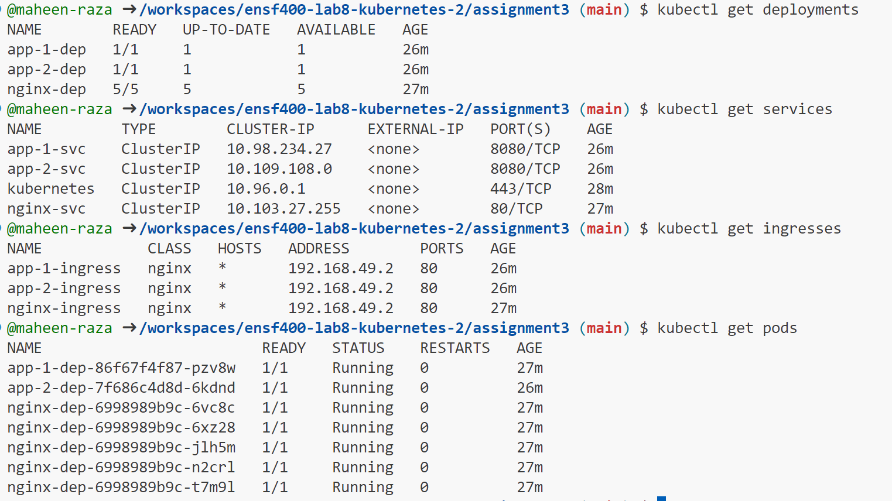
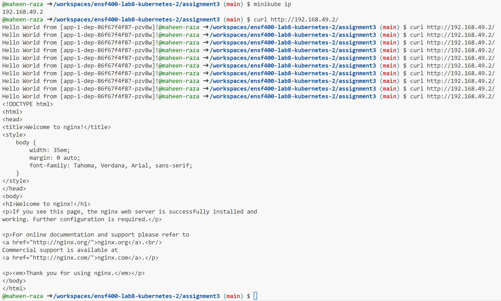

## Steps I took to complete the assignment:

In order to complete assignment 3 for this course, these are the steps I took:

I first created the "nginx-dep.yml" deployment configuration file, where I defined the type and metadata, and made sure that it created 5 replicas of pods, and created a container by pulling from the base image nginx with the version tag 1.14.2, and exposed containerPort 80. I then also made sure to mount the configMap named nginx-configmap in the "nginx-configmap.yml" file as a volume at the path "/etc/nginx/default.conf". As per the instructions, when I tried mounting it at the path "/etc/nginx/conf.d", all 5 nginx deployments would not run. I used the "/etc/nginx/default.conf", as it was something I had similarily done in assignment 2, where it's the path to the configuration file, and luckily it worked.

I then created the configMap in the "nginx-configmap.yml" file. Within this file, I made sure to define the configuration file that specifies two backend servers as a value to the key "default.conf". This means that the actual name of the configuration file is "default.conf".

I then created the "nginx-ingress.yml" file, where I made sure to redirect the requests to "/" to the backend "nginx-svc" service.

I then created all the files for app 1 and app 2, starting with the deployment files. I used the example file that Dr. Drew provided for "app-1-dep.yml", where there's a singular replica of a pod and it creates a container by pulling an image from ghcr.io/denoslab/ensf400-sample-app:v1 and ghcr.io/denoslab/ensf400-sample-app:v2 for app 1 and app 2 respectively. Both of these applications expose port 3000, which was a change made by Dr. Drew himself. I then created the ingress files in order to define the routing rules for HTTP traffic. Any requests from the path "/" are forwarded to app-1-svc and app-2-svc via port 8080. I made sure that app-1 was the main deployment and app-2 was the canary deployment, and defined the weights as 70% and 30% respectively. This means 70% of traffic is routed to app-1 and 30% of traffic is routed to app-2. Lastly, I created the service files app-1-svc and app-2-svc for each of the applications. They select the appropriate pod (either app-1 or app-2), and exposes them on port 8080. Once traffic arrives on port 8080, it gets redirected to port 3000 on either of the pods, either for app-1 or app-2.

In order to make sure I did all the steps completely, I ran the following commands first to start up the environment and enable ingress:

1. minikube start
2. minikube addons enable ingress

In order to create each service, depoyment and ingress, I ran each of the following commands:

1. kubectl apply -f nginx-dep.yml
2. kubectl apply -f nginx-configmap.yml
3. kubectl apply -f nginx-svc.yml
4. kubectl apply -f nginx-ingress.yml
5. kubectl apply -f app-1-dep.yml
6. kubectl apply -f app-1-svc.yml
7. kubectl apply -f app-1-ingress.yml
8. kubectl apply -f app-2-dep.yml
9. kubectl apply -f app-2-svc.yml
10. kubectl apply -f app-2-ingress.yml

In order to check if all the deployments, services, ingresses and pods have been created, I ran the following commands and got the following output.

1. kubectl get deployments
2. kubectl get services
3. kubectl get ingresses
4. kubectl get pods

This output shows that all deployments are up and running, including all 5 replicas of nginx and each replica for app-1 and app-2. It also shows that all services and ingresses for nginx, app-1 and app-2 are have also been created.

I then ran the following command in order to check if the responses from load-balanced app backends were working, and I got the following output.

1. minikube ip
2. curl http://(minikube ip)/

While app-1 worked as expected, when it would switch to app-2, I would get the nginx default page, which was strange. I tried troubleshooting for hours and could not understand what had gone wrong, but at least the overall functionality works.